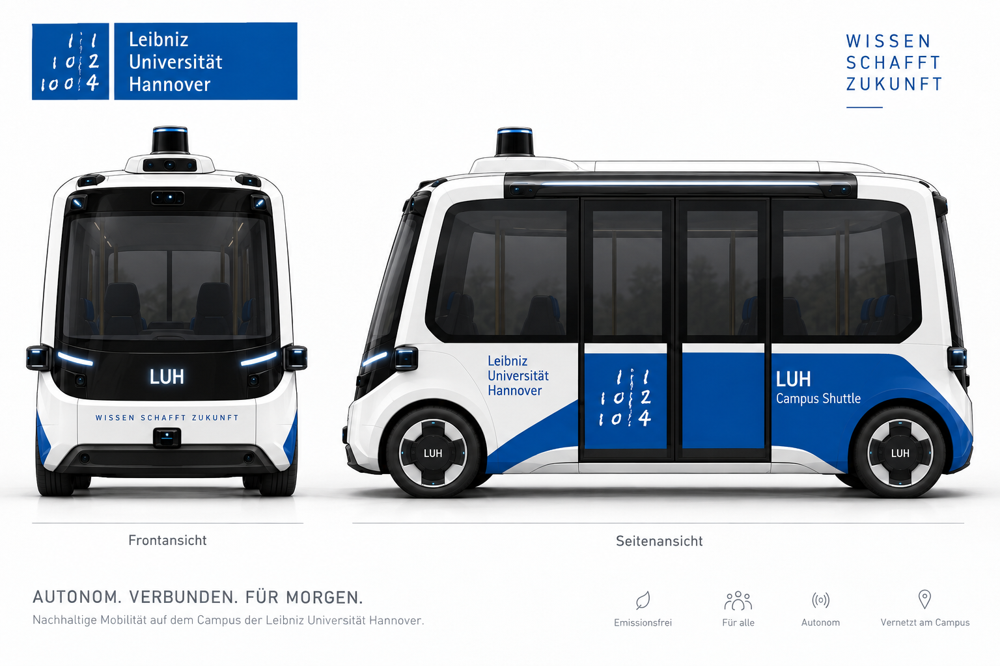

<a id="readme-top"></a>

<!-- PROJECT SHIELDS -->
[![Python][python-shield]][python-url]
[![Issues][issues-shield]][issues-url]
[![Last Commit][commit-shield]][commit-url]


<!-- PROJECT LOGO -->
<br />
<div align="center">
  <a href="https://github.com/sebastian-kleinschmidt/autonomy_recovery_lab_students">
    
  </a>

  <h3 align="center">Autonomy Recovery Lab</h3>

  <p align="center">
    Laborversuch zu Agentic AI: Ein autonomer Kleinbus steckt fest – euer Agent holt ihn da raus.
    <br />
    <a href="autonomy_recovery_sim/tutorials/README.md"><strong>Zum Lernpfad »</strong></a>
    <br />
    <br />
    <a href="#schnellstart">Schnellstart</a>
    &middot;
    <a href="autonomy_recovery_sim/ASSIGNMENT.md">Laboraufgabe</a>
    &middot;
    <a href="https://github.com/sebastian-kleinschmidt/autonomy_recovery_lab_students/issues">Fehler melden</a>
  </p>
</div>


<!-- TABLE OF CONTENTS -->
<details>
  <summary>Inhalt</summary>
  <ol>
    <li>
      <a href="#über-den-versuch">Über den Versuch</a>
      <ul>
        <li><a href="#was-ihr-lernt">Was ihr lernt</a></li>
        <li><a href="#technische-grundlage">Technische Grundlage</a></li>
      </ul>
    </li>
    <li>
      <a href="#erste-schritte">Erste Schritte</a>
      <ul>
        <li><a href="#voraussetzungen">Voraussetzungen</a></li>
        <li><a href="#schnellstart">Schnellstart</a></li>
      </ul>
    </li>
    <li><a href="#den-eigenen-agenten-entwickeln">Den eigenen Agenten entwickeln</a></li>
    <li><a href="#dokumentation">Dokumentation</a></li>
    <li><a href="#prüfungen">Prüfungen</a></li>
    <li><a href="#roadmap">Roadmap</a></li>
    <li><a href="#mitarbeit">Mitarbeit</a></li>
    <li><a href="#lizenz">Lizenz</a></li>
    <li><a href="#kontakt">Kontakt</a></li>
    <li><a href="#danksagung">Danksagung</a></li>
  </ol>
</details>


<!-- ABOUT THE PROJECT -->
## Über den Versuch

Ein automatisiertes Fahrzeug gerät in eine Lage, die sein Fahrstack allein nicht
auflöst: ein Lieferwagen in zweiter Reihe, eine ausgefallene Ampel, Ladung auf der
Fahrbahn, eine Baustelle ohne Umleitung. Das Fahrzeug bleibt stehen. Ab hier
übernimmt euer **Autonomy Recovery Agent**:

1. Er **untersucht die Lage** mit Werkzeugen: Hindernis, Gegenverkehr, Sicht,
   Karte, Mission, Selbstauskunft des Fahrstacks.
2. Er **wählt einen High-Level-Befehl**, etwa warten, vorsichtig umfahren,
   zurücksetzen, umplanen oder die Leitstelle rufen. Lenkwinkel oder Trajektorien
   gibt es nicht.
3. Der Simulator **prüft den Befehl** gegen Verkehrsregeln und Sicherheitsregeln,
   **führt ihn aus** und **bewertet** Sicherheit, Erfolg, Standzeit und Kosten.

Ihr arbeitet als Viererteam und entwickelt den Agenten schrittweise: zuerst
spielt ihr selbst Agent, dann baut ihr einen Regelagenten, danach einen
LLM-Agenten. Am Ende messt ihr beide unter Störungen und vergleicht sie.

<p align="right">(<a href="#readme-top">nach oben</a>)</p>

### Was ihr lernt

- woraus ein Agent besteht: Schleife, Werkzeuge, Gedächtnis, Budgets und Regeln,
  die ihn begrenzen
- wann Regeln reichen und wann ein Sprachmodell hilft
- wie man einem Modell misstraut, das seine Entscheidungen in Worten begründet
  (VLA-Fahrstack nach dem Vorbild von NVIDIA Alpamayo)
- wie man Agenten reproduzierbar misst, statt nach Gefühl zu urteilen

Die Lernziele stehen in der [Laboraufgabe](autonomy_recovery_sim/ASSIGNMENT.md). Das Labor ist
unbenotet: Jeder Lauf zeigt, wie gut euer Ansatz funktioniert, wo er scheitert und ob er sich
seit dem letzten Lauf verbessert hat.

<p align="right">(<a href="#readme-top">nach oben</a>)</p>

### Technische Grundlage

Der deterministische 2D-Simulator **AutonomyRecoverySim** bringt mit:

- **61 Szenarien** auf echten Straßen in Hannover (OpenStreetMap), dazu sechs
  **Szenariofamilien** mit je drei Varianten, deren Lage sich während des Manövers ändert
- **24 High-Level-Befehle**, darunter Phasenmanöver wie vortasten, überholen und wenden,
  mit Regelprüfung, Sicherheitsprüfung und Kostenmodell
- zwei **Wahrnehmungsmodelle**: fertige Urteile oder eine Objektliste mit Messunsicherheit im
  Stil eines Fahrstacks, und drei **Prüfmodi**, bis hin zu Unfällen, die der Agent erkennen
  und abwickeln muss
- Sichtlinien und Verdeckung, Phantomobjekte, veraltete Sensordaten,
  Werkzeugausfälle
- einen **VLA-Fahrstack-Mock** nach dem Vorbild von NVIDIA Alpamayo 1.5, der
  seine Fahrabsicht in Text begründet und sich dabei auch irren kann
- eine **Browseroberfläche** mit 2D- und 3D-Ansicht und einer Recovery Console,
  über die ihr den Agenten von Hand spielt
- **Batchläufe** mit HTML-Bericht, Fortschritt seit dem letzten Lauf, Wiederholungen und
  verdeckten Prüffällen

Der Simulator nutzt ausschließlich die Python-Standardbibliothek. Er läuft
ohne GPU, Modellgewichte oder Clusterzugang.

<p align="right">(<a href="#readme-top">nach oben</a>)</p>


<!-- GETTING STARTED -->
## Erste Schritte

### Voraussetzungen

- **Python 3.10 oder neuer** unter Linux, macOS oder Windows
- ein Browser mit WebGL für die 3D-Ansicht
- für einen echten LLM-Agenten zusätzlich ein erreichbarer
  OpenAI-kompatibler Chat-Completions-Endpunkt mit Tool Calling. Zugang und Modell
  werden über Umgebungsvariablen eingestellt; die Vorlage dafür ist
  [.env.example](autonomy_recovery_sim/.env.example).

Für die ersten Schritte braucht ihr keinen Modellzugang. Ein lokales
Spielmodell ersetzt das Sprachmodell ohne API-Schlüssel.

### Schnellstart

Alle Befehle im Wurzelverzeichnis des Repositorys ausführen. Ein `pip install`
ist nicht nötig; eine virtuelle Umgebung ist optional:

```bash
git clone https://github.com/sebastian-kleinschmidt/autonomy_recovery_lab_students.git
cd autonomy_recovery_lab_students
python3 -m venv .venv
source .venv/bin/activate
```

Unter Windows in PowerShell: `py -3 -m venv .venv`, danach
`.\.venv\Scripts\Activate.ps1`. In der aktivierten Umgebung funktioniert
`python` auf allen Plattformen. Ohne virtuelle Umgebung `python` unter
Linux/macOS durch `python3` und unter Windows durch `py -3` ersetzen.

```bash
# Mitgelieferte Szenarien prüfen
python -m autonomy_recovery_sim validate autonomy_recovery_sim/scenarios

# Fahrt beobachten und die Recovery Console von Hand bedienen
python -m autonomy_recovery_sim.live
```

Im Browser **http://127.0.0.1:8765** öffnen und **Starten** wählen. Den Server
im Terminal mit `Ctrl+C` beenden. Zum Vergleich übernimmt die Referenzheuristik:

```bash
python -m autonomy_recovery_sim.live --agent baseline
```

Der erste reproduzierbare Vergleich nutzt die acht Fälle der Sprint-1-Freigabe:

```bash
python -m autonomy_recovery_sim batch --release sprint1 --agent baseline
```

Die Ergebnisse liegen unter `artifacts/autonomy-recovery-sim/batch/`
(`batch-report.html`, `batch-report.md`, `batch-result.json` und Details je
Szenario). Ein Batchlauf endet mit Exit-Code `1`, wenn mindestens ein Fall
nicht bestanden wurde. Die Baseline löst die späteren Fälle bewusst nicht alle.

<p align="right">(<a href="#readme-top">nach oben</a>)</p>


<!-- USAGE EXAMPLES -->
## Den eigenen Agenten entwickeln

Beginnt mit dem [Team-Lernpfad](autonomy_recovery_sim/tutorials/README.md). Nach dem Bootcamp
baut ihr im **Tutorial-Track** einen Agenten, der von Lektion zu Lektion wächst. Jede Lektion
endet mit Ideen, wie ihr ihn selbst weiter verbessert.

| Lektion | Was dazukommt |
|---|---|
| [L1 · Einfachster Agent](autonomy_recovery_sim/tutorials/L1-einfachster-agent.md) | Schnittstelle, Messung |
| [L2 · Regelagent](autonomy_recovery_sim/tutorials/L2-regelagent.md) | Werkzeuge, Entscheidungsbaum |
| [L3 · Gedächtnis](autonomy_recovery_sim/tutorials/L3-gedaechtnis.md) | Verlauf, Ablehnungen, mehrere Schritte |
| [L4 · Selbst wahrnehmen](autonomy_recovery_sim/tutorials/L4-selbst-wahrnehmen.md) | Objektliste mit Messunsicherheit |
| [L5 · LLM-Agent](autonomy_recovery_sim/tutorials/L5-llm-agent.md) | Sprachmodell für die offenen Fälle |
| [L6 · Alpamayo misstrauen](autonomy_recovery_sim/tutorials/L6-alpamayo-misstrauen.md) | Quellen und Datenqualität prüfen |
| [L7 · Phasen und Dynamik](autonomy_recovery_sim/tutorials/L7-phasen-und-dynamik.md) | Checkpoints, Wenden, Lagen, die sich ändern |
| [L8 · Unfälle und Schutzregeln](autonomy_recovery_sim/tutorials/L8-unfaelle-und-schutzregeln.md) | Unfall abwickeln, rote Linien |

Euer Agent lebt in einer Datei `mein_agent.py` im Wurzelverzeichnis:

```bash
cp autonomy_recovery_sim/tutorials/track/l1_start.py mein_agent.py
python -m autonomy_recovery_sim batch autonomy_recovery_sim/scenario_sets/released_sprint1.txt --agent mein_agent:decide
```

Der ganze Track ist ohne Schlüssel machbar; für L5 gibt es ein Spielmodell
(`AUTONOMY_RECOVERY_MODEL=spielmodell`). Modellzugang und erste echte LLM-Läufe beschreibt der
[technische Quickstart](autonomy_recovery_sim/QUICKSTART.md).

<p align="right">(<a href="#readme-top">nach oben</a>)</p>


## Dokumentation

**Für Studierende**, in dieser Reihenfolge:

| Dokument | Wofür |
|---|---|
| [Lernpfad](autonomy_recovery_sim/tutorials/README.md) | Einstieg, Teamarbeit und der Tutorial-Track L1 bis L8 |
| [Grundlagen](autonomy_recovery_sim/tutorials/00-grundlagen.md) und [Konsole](autonomy_recovery_sim/tutorials/01-recovery-agent-spielen.md) | Was ein Agent ist; den Agenten einmal von Hand spielen |
| [Laboraufgabe](autonomy_recovery_sim/ASSIGNMENT.md) | Ziele, Teil A bis C, Rückmeldung statt Note |
| [Prüfstand](autonomy_recovery_sim/PRUEFSTAND.md) | Batchläufe, Befunde, Fortschritt, Wiederholungen |
| [Messen und berichten](autonomy_recovery_sim/tutorials/06-evaluieren.md) | Experimente, Fehleranalyse, Laborbericht |
| [Spickzettel](autonomy_recovery_sim/tutorials/CHEATSHEET.md) und [Glossar](autonomy_recovery_sim/tutorials/GLOSSAR.md) | Zum Nachschlagen |
| [Quickstart](autonomy_recovery_sim/QUICKSTART.md) | Modellzugang und erste LLM-Läufe |
| [Grundlagenskript](docs/AGENTIC-AI.md) | Agentic AI zum Nachlesen |

**Referenz** für alle: [Simulator](autonomy_recovery_sim/README.md) (Agentenvertrag,
Wahrnehmung, Prüfmodi, Auslöser), [Befehle](autonomy_recovery_sim/COMMANDS.md) (Parameter,
Regeln, Kosten, Einstufung) und [Szenarien](autonomy_recovery_sim/SCENARIOS.md) (Freigaben,
Familien).

**Einstiegsveranstaltung:** Präsentation als [HTML](docs/Auftakt_Autonomy_Recovery_Lab.html)
(im Browser öffnen, Pfeiltasten, `N` für Notizen), [PDF](docs/Auftakt_Autonomy_Recovery_Lab.pdf)
und [PPTX](docs/Auftakt_Autonomy_Recovery_Lab.pptx).

**Zum Simulator:** [bekannte Fehler](autonomy_recovery_sim/BUGS.md) und
[Assets](autonomy_recovery_sim/ASSETS.md).

### Verzeichnisse

| Pfad | Inhalt |
|---|---|
| [autonomy_recovery_sim/](autonomy_recovery_sim/README.md) | Simulator, Agentenschnittstelle, Browseroberfläche, Szenarien und Daten |
| [tutorials/](autonomy_recovery_sim/tutorials/README.md) | Lektionen, Startstände (`track/`), Archiv, Glossar, Spickzettel und Vorlagen |
| [scenarios/](autonomy_recovery_sim/scenarios/), [families/](autonomy_recovery_sim/families/) | Szenarien und Szenariofamilien als JSON |
| [scenario_sets/](autonomy_recovery_sim/scenario_sets/) | Szenariomengen für Batchläufe |
| [docs/](docs/) | Grundlagenskript, Präsentation zur Einstiegsveranstaltung |
| [tests/](tests/) | Automatisierte Tests einschließlich lauffähiger Lehrbeispiele |

<p align="right">(<a href="#readme-top">nach oben</a>)</p>


## Prüfungen

```bash
python -m unittest tests.test_autonomy_recovery_sim   # Selbsttest, gut eine halbe Minute
python -m unittest discover -s tests                   # alle Tests, rund zehn Minuten
python autonomy_recovery_sim/scripts/build_scenario_sets.py --check
```

Die Tests brauchen weder Netzwerk noch API-Schlüssel. Laufzeitausgaben unter
`artifacts/`, virtuelle Umgebungen und lokale Zugangsdaten ignoriert Git.
`.env`-Dateien lädt der Simulator nicht automatisch.

<p align="right">(<a href="#readme-top">nach oben</a>)</p>


<!-- ROADMAP -->
## Roadmap

Der Simulator wird realistischer, ohne dass bestehende Aufgaben brechen: Ohne
neue Einstellungen verhalten sich alle Szenarien wie bisher.

- [x] Schwierigkeit und Prüfmodus pro Szenario (`strict`, `advisory`, `off`):
  Wer ohne Prüfung losfährt, muss mit den Folgen rechnen
- [x] Realistische Wahrnehmung: Objektliste mit Messunsicherheit, Sichtabdeckung
  und Karte statt fertiger Urteile (`--perception tracked`)
- [x] Unfallfolgen: Die Fahrt geht nach einer Kollision weiter, und der Agent
  muss den Unfall erkennen und richtig abwickeln
- [x] Komplexere Manöver mit Phasen, etwa vortasten, ausscheren und schauen,
  überholen, wenden oder auf eine Lücke warten
- [x] Lagen, die sich während des Manövers ändern, etwa eine Ursache, die erst
  beim Ausscheren sichtbar wird (Szenariofamilien F1 bis F6)
- [x] Neuer Tutorial-Track: in acht Lektionen zu immer komplexeren Agenten, jede
  mit Ideen zum Weiterbauen

Fehler und Wünsche bitte als [Issue](https://github.com/sebastian-kleinschmidt/autonomy_recovery_lab_students/issues)
melden.

<p align="right">(<a href="#readme-top">nach oben</a>)</p>


<!-- CONTRIBUTING -->
## Mitarbeit

Fehler im Simulator, unklare Aufgaben oder Ideen für neue Szenarien sind
willkommen:

1. Issue anlegen oder einen Branch erstellen (`git switch -c feature/mein-vorschlag`)
2. Änderungen vornehmen und die [Prüfungen](#prüfungen) laufen lassen
3. Committen (`git commit -m "feat: ..."`) und pushen
4. Einen Pull Request öffnen

Neue Szenarien beschreibt die [Simulator-Dokumentation](autonomy_recovery_sim/README.md);
der Katalog in [SCENARIOS.md](autonomy_recovery_sim/SCENARIOS.md) zeigt, wie
sie in die gestuften Freigaben kommen.

<p align="right">(<a href="#readme-top">nach oben</a>)</p>


<!-- LICENSE -->
## Lizenz

Für den Code ist noch keine Lizenz festgelegt. Kartendaten: © OpenStreetMap-Mitwirkende,
verfügbar unter der Open Database License (ODbL). Quellen und Abrufdaten stehen in den
[Datendateien](autonomy_recovery_sim/data/) und der
[Simulator-Dokumentation](autonomy_recovery_sim/README.md#reales-kartenmaterial).

<p align="right">(<a href="#readme-top">nach oben</a>)</p>


<!-- CONTACT -->
## Kontakt

Sebastian Kleinschmidt, Leibniz Universität Hannover

Projekt: [github.com/sebastian-kleinschmidt/autonomy_recovery_lab_students](https://github.com/sebastian-kleinschmidt/autonomy_recovery_lab_students)

<p align="right">(<a href="#readme-top">nach oben</a>)</p>


<!-- ACKNOWLEDGMENTS -->
## Danksagung

* [OpenStreetMap](https://www.openstreetmap.org) für die Kartendaten aus Hannover
* [NVIDIA Alpamayo](https://huggingface.co/nvidia/Alpamayo-1.5-10B) als Vorbild für den VLA-Fahrstack-Mock
* [Autoware](https://autoware.org) als Vorbild für das Format der Objektliste
* [Best-README-Template](https://github.com/othneildrew/Best-README-Template) für den Aufbau dieser Datei
* [Img Shields](https://shields.io) für die Badges

<p align="right">(<a href="#readme-top">nach oben</a>)</p>


<!-- MARKDOWN LINKS & IMAGES -->
[python-shield]: https://img.shields.io/badge/Python-3.10%2B-3776AB?style=for-the-badge&logo=python&logoColor=white
[python-url]: https://www.python.org/
[issues-shield]: https://img.shields.io/github/issues/sebastian-kleinschmidt/autonomy_recovery_lab_students.svg?style=for-the-badge
[issues-url]: https://github.com/sebastian-kleinschmidt/autonomy_recovery_lab_students/issues
[commit-shield]: https://img.shields.io/github/last-commit/sebastian-kleinschmidt/autonomy_recovery_lab_students.svg?style=for-the-badge
[commit-url]: https://github.com/sebastian-kleinschmidt/autonomy_recovery_lab_students/commits/main
